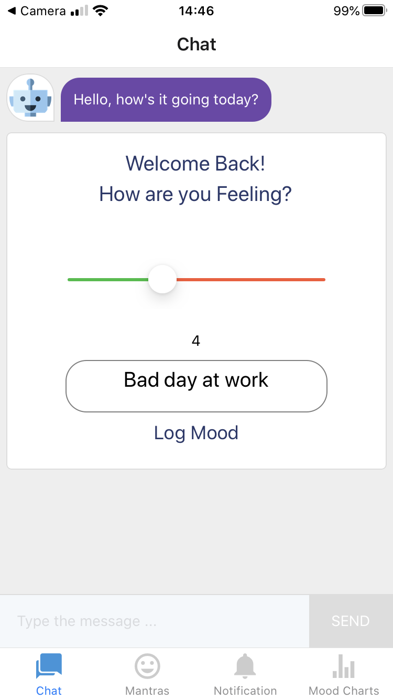
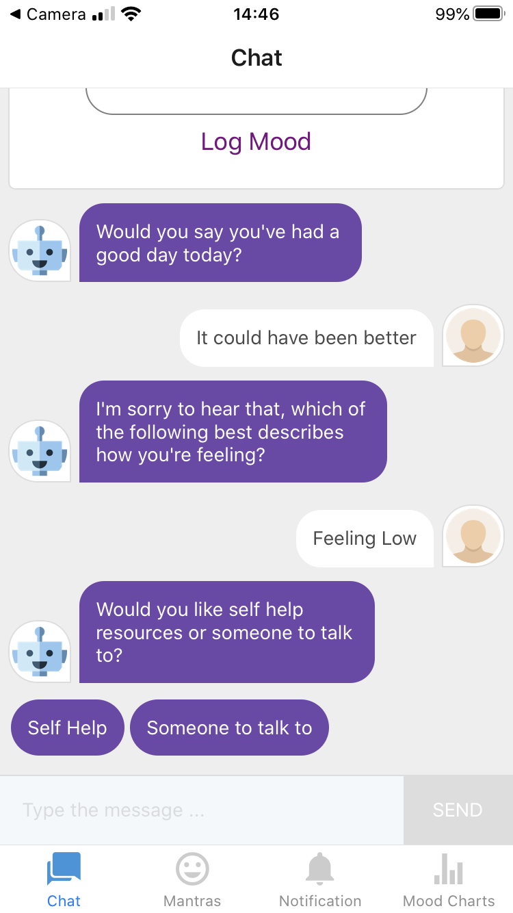
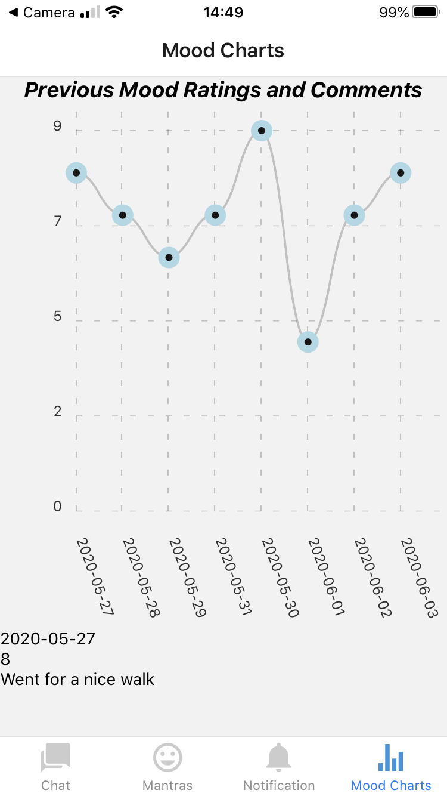
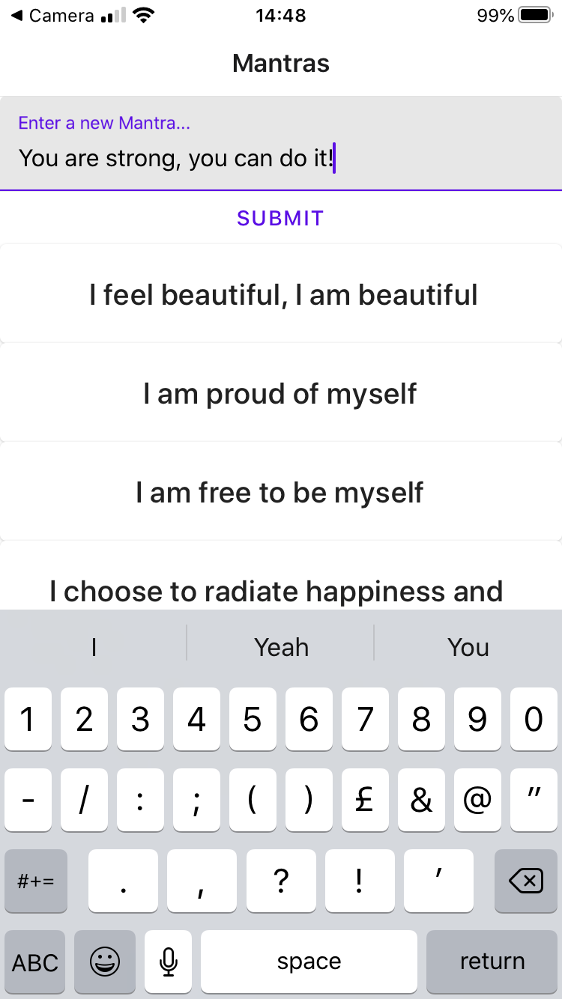
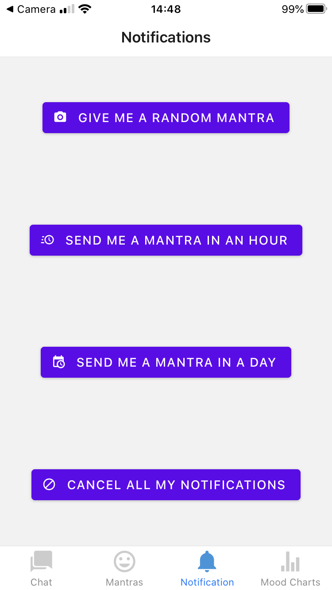

# Pocket Positivity

This is the winning entry from the June 2020 Hack for Heroes Hackathon. The time limit for the project to be submitted was 2.5 days and the brief of the hackathon was to build a piece of technology that could be used to directly help the heroes that are working on the front line. The team consisted of [Myself](https://github.com/asiaellis5), [David](https://github.com/davidpaps) [Bassel](https://github.com/basselalsayed), [Ben](https://github.com/benjamaker), [Lucian](https://github.com/lucianboatright), [Nic](https://github.com/nicolasraffray) and [Tom](https://github.com/Walker-TW).

The original repo with the full commit history can be found [here](https://github.com/basselalsayed/pocket_positivity). This project will continue to be developed to scale further features, however I wished to keep this repo at the exact state it was after the 2.5 days of coding by the team, to show what we achieved during the time, and keep the project in it's winning state.

---

## About the App / Features

After this group of developers were randomly assigned, we brainstormed and quickly identified that the theme we wanted our app to have would be focused on Mental Health. Key workers are under tremendous pressure at the best of time, let alone during a pandemic. They often risk their health in order to provide and care for us, this is whay we wanted to give something back to the key workers, and build an app that focused on helping them track, deal with and improve their mental health.

We decided to make the app accessible and avaliable to the majority of key workers. It was important for us to allow them to track and log their mood on the go, therefore making a `React Native` / `Expo` app made sense. Although no one in the group had ever had experience using this technology, we concluded that we had the skills and depth in the team to succeed, providing use for both `iOS` and `Android` devices. We used `Node.js` / `Express.js` for the backend server, and used `PostgreSQl` as our relational database to store the data. We then deployed the backend on [Heroku](https://help-for-heroes.herokuapp.com/), making the relevent SQL queries to this backend APi. The repo for the backend can be found [here](https://github.com/davidpaps/pocket_positivity_backend).

**We decided and created the folloing features for the app:**

The user signs in to the app. Their relevent data is then drawn from the database to be used for the following features.

After signing in, the page switches to the a page that puts you in a conversation with a chatbot. The chatbot is automatically loaded with a component that asks for the users mood value (1 - 10, 1 being low, 10 being high) and a brief comment explaning why that is their mood. The chatbot will then take the user through a series of basic questions and dynamically give resources or tips based on the user input.

Past inputs can then be collectively viewed on a graph (built in `Chart.js`). The scores and comments can then be viewed in an attempt to to recognise trends for positive or negative emotions over time.

A user can then set positive messages to be sent via in-app push notifications. Pre set mantras were included, but the user could also add their own, which would be stored in the database. A user can then set a mantra to notify them at a given interval. This is to provide constant positive affirmation, a powerful tool from the branch of psychology - Neural Linguistic Programming.

---

## How to Run

First, visit the [backend repo](https://github.com/davidpaps/pocket_positivity_backend) and follow the instructions in the README to install the necessary dependencies and configure the database and tables necessary to run the app. Whilst the local host is then running, keeping the backend server live, open up another command line interface and text editor. Clone this repo and in this codes command line type:

```
yarn install
```

This will install the dependancies necessary to run the front end of the application. You will then need to download the `Expo SDK` on your machine by typing in the command line:

```
npm i -g expo-cli
```

Once this has installed you are ready to run the app. You will then need download the Expo app. Visit either the [App Store](https://apps.apple.com/us/app/expo-client/id982107779) for use with `iOS`, or the [Play Store](https://play.google.com/store/apps/details?id=host.exp.exponent&hl=en_GB) for use on `Android`. Once the app has downloaded on the handheld device, and after you have signed up for a free account, you can then type in the command line:

```
yarn start
```

This will boot up the Expo Client. A page will automatically open and load in the browser at [this](http://localhost:19002/) address. The last thing you will need to do is to open the camera on your handheld device. Point this at the QR code displayed on the screen, and a prompt will come up saying `Open in Expo`. Click this notification and the application will render on your device. You are then ready to sign up for `Pocket Positivity`.

---

<table>
  <tr>
     <td>Sign In</td>
      <td>Mood Component</td>
      <td>Chatbot</td>
  </tr>
  <tr>
    <td valign="top"></td>
    <td valign="top"></td>
     <td valign="top"></td>
  </tr>
 </table>

 <table>
  <tr>
     <td>Mood Chart</td>
      <td>Mantras</td>
      <td>Notifications</td>
  </tr>
  <tr>
    <td valign="top"></td>
    <td valign="top"></td>
     <td valign="top"></td>
  </tr>
 </table>

---

## Acknowledgements

**All of the heroes working through this tough time**

[React-Chatbot-Native](https://github.com/LucasBassetti/react-native-chatbot) is primarily written and maintained by [Lucas Bassetti](https://github.com/LucasBassetti). Expo functionality is patched by [Jérémie Zarca](https://github.com/jzarca01).

---
